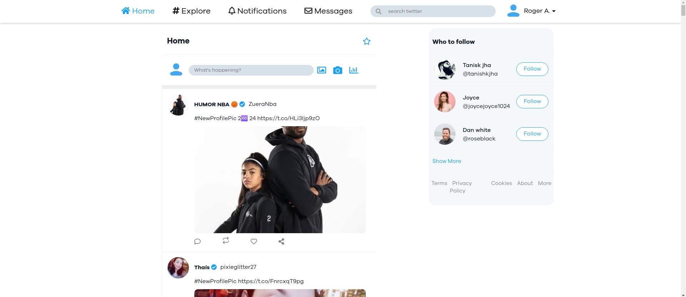
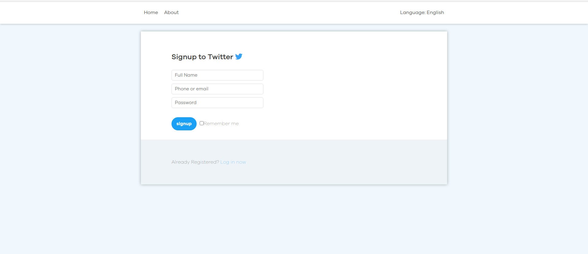

# Twitter-clone

 

 

## Deployed on herokuapp
[View The Live Project](http://clonetwit.herokuapp.com/)
http://clonetwit.herokuapp.com/

### for now only front-end part is working.
### due to some errors back-end part is not working properly.

## :scroll: Todo
- [x] Like
- [x] Comment
- [x] Search
- [x] Retweet

## UI

## Home

## Login

## Signup

## Tweet

## Feature
* Sign up - Working
* Login - Working
* Post - Working
* Comment - issues
* Follow - Working

 

## :rocket: Tecnologias
<ul>
  <li>Nodemon</li>
  <li>MongoDB</li>
  <li>Mongoose</li>
  <li>Routes</li>
  <li>Express</li>
  <li>Cors</li>
  <li>Express</li>
  <li>axios</li>
  <li>React</li>
  <li>React-Router</li>
	
</ul>

### ReactJS
<ul>
  <li>npm install</li>
  <li>npm run start / npm start</li>
</ul>

## backend-routes
### routes

router.post(
	'/',
	[
		check('name', 'Name is required')
			.not()
			.isEmpty(),
		check('email', 'Please include a valid email').isEmail(),
		check(
			'password',
			'Please enter a password with 6 or more characters'
		).isLength({ min: 6 })
	],
	async (req, res) => {
		const errors = validationResult(req);
		if (!errors.isEmpty()) {
			return res.status(400).json({ errors: errors.array() });
		}
		const { name, email, password } = req.body;
		try {
			let user = await User.findOne({ email });
			if (user) {
				return res.status(400).json({ msg: 'User already exists' });
			}
			user = new User({
				name,
				email,
				password
			});
			const salt = await bcrypt.genSalt(10);
			user.password = await bcrypt.hash(password, salt);
			await user.save();
			const payload = {
				user: {
					id: user.id
				}
			};
			jwt.sign(
				payload,
				config.get('jwtSecret'),
				{ expiresIn: 360000 },
				(err, token) => {
					if (err) throw err;
					res.json({ token });
				}
			);
		} catch (err) {
			console.error(err.message);
			res.status(500).send('Server error');
		}
	}
);

## model> userSchema

const mongoose = require('mongoose');

const UserSchema = new mongoose.Schema({
	name: {
		type: String,
		required: true
	},
	email: {
		type: String,
		required: true,
		unique: true
	},
	password: {
		type: String,
		required: true
	},
	date: {
		type: Date,
		default: Date.now
	}
});

module.exports = mongoose.model('user', UserSchema);

## comment Schema
const mongoose = require("mongoose");

const CommentSchema = new mongoose.Schema({
  user: {
    type: mongoose.Schema.ObjectId,
    ref: "User",
    required: true,
  },
  post: {
    type: mongoose.Schema.ObjectId,
    ref: "Post",
    required: true,
  },
  text: {
    type: String,
    required: [true, "Please enter the comment"],
    trim: true,
  },
  createdAt: {
    type: Date,
    default: Date.now,
  },
});

module.exports = mongoose.model("Comment", CommentSchema);
